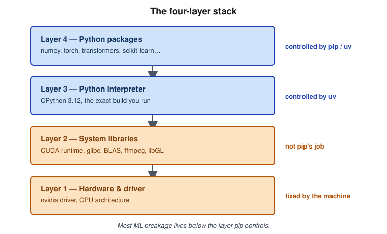

# M1 · Why ML dependencies break 🟢

> ⏱ 10 minutes · Route: Full, Notebook-first
>
> This is the only theory module in the book. Everything after it is commands.

## 3 a.m. story

*The model trains fine on your laptop. On the training cluster it dies with
`CUDA error: no kernel image is available for execution on the device`. Same
`requirements.txt`. Same git SHA. Same `torch==2.6.0`.*

## What's actually going on

### The four-layer stack



```
Layer 4  Python packages       ← pip/uv controls this
Layer 3  Python interpreter    ← uv controls this
Layer 2  System libraries      ← CUDA runtime, glibc, BLAS, ffmpeg, libGL
Layer 1  Hardware and driver   ← nvidia driver, CPU architecture
```

Most "dependency management" writing is aimed at web services, where layer 4
*is* the whole problem — every dependency is a Python (or JS) package, full
stop. ML breaks that assumption. A model that "just imports torch" is also
pinned to a CUDA runtime, a driver version on the host, glibc, and whatever
BLAS got linked into numpy — none of which `pip` or `uv` can see, let alone
install. The CUDA error in this module's 3 a.m. story is a layer 1/2 failure
wearing a layer 4 costume: same `requirements.txt`, different driver.

The one-sentence version, worth remembering more than anything else in this
module: **most ML dependency pain lives below the layer pip controls**, which
is why "just pin your requirements" is advice that keeps failing you. Every
module after this one will tell you which layer it's operating on — M2 owns
layers 3–4, M6 is the one that finally goes below the line.

### Abstract vs concrete dependencies

| | Abstract | Concrete |
|---|---|---|
| Answers | "What do I support?" | "What did I actually run?" |
| Looks like | `scikit-learn>=1.5` | `scikit-learn==1.5.2` + hash |
| Lives in | `pyproject.toml` | `uv.lock` |
| Audience | humans, resolvers | machines, CI, your future self |
| Edited by hand? | yes | never |

You need both, and most teams that get burned only have one — usually the
wrong one. A repo with only ranges (`pandas>=2.2`, no lock) resolves
differently every time someone installs it: that's "works on my machine" as
a design choice, not an accident. A repo with only pins and no ranges
(hand-maintained `requirements.txt` with `==` everywhere) can't tell you what
it actually *needs* versus what happened to get installed the day someone
ran `pip freeze`. The range is your intent; the lock is your evidence. Ship
from the lock, reason about upgrades from the range.

This splits cleanly by what you're building. **Applications and pipelines**
— the thing you deploy — keep loose ranges in `pyproject.toml`, hard pins in
`uv.lock`, and deploy from the lock. **Libraries** — the thing other people
install alongside their own stuff — keep loose ranges, don't ship a
committed lock as part of the published package, and test against a matrix
of versions instead, because your resolver's job is to fit into *someone
else's* environment, not to own one.

### The diamond problem

Say your project needs package `A`, which requires `numpy<2`, and package
`B`, which requires `numpy>=2`. You need both `A` and `B`. There is no single
version of `numpy` that satisfies both constraints — this is the diamond
problem, and it's not a bug in the resolver, it's the resolver correctly
telling you the request is impossible.

A resolver's job is to find one version of every package such that every
constraint, from every package in the tree, holds simultaneously. When it
can't, you get "resolution impossible" (uv) or a wall of backtracking (pip) —
either way, the tool is not broken, your dependency graph has a real
conflict that existed before you ran the command. It just surfaces it.

There are exactly three real fixes: upgrade `A` to a version that supports
`numpy>=2`, drop whichever of `A`/`B` you need less, or split them into two
separate environments if you truly need both and they can't coexist. There
is no fourth option where you keep the conflicting requirements and it
resolves anyway — if a tool lets you install both, you've just moved the
conflict from resolve-time to runtime, which is worse. [M2](02-uv.md) covers
the tactical version of this — constraints, overrides, and reading the error
message uv gives you.

### SemVer, and why ML libraries ignore it

Semantic Versioning promises that a patch bump (`4.30.1` → `4.30.2`) is safe
and a minor bump (`4.30` → `4.31`) doesn't break your code. Both promises are
about the *API surface* — function signatures, imports, return types. Neither
says anything about the *numbers* a function returns. A patch release of
`transformers` that changes a default tokenization behavior, or a minor
`scikit-learn` bump that changes a solver's default, can move your model's
output measurably without touching a single signature. Your code still runs.
Your metric didn't.

The contract you actually care about in ML is numerical, and SemVer doesn't
cover it — nobody's version scheme does. The consequence: "no API break"
is not the same claim as "safe to upgrade." That gap is exactly why
[M8](08-supply-chain.md)'s upgrade ritual runs an eval set against every
bump that touches model code, not just a test suite that only checks the
code still imports.

## ⚠️ The anti-pattern gallery

| Anti-pattern | Why it feels fine | What it actually costs | Fix |
|---|---|---|---|
| `pip freeze > requirements.txt` | "Now I have a lockfile" | Captures every package you happen to have installed, loses which ones you actually chose, no hashes, not cross-platform | [M2](02-uv.md) — `uv add` + `uv.lock` |
| `!pip install x` in a notebook cell | Fast, unblocks you right now | Environment drifts from the repo silently; a reviewer reading the diff never sees it happened | [Lab 2](labs/lab-2.md) |
| `FROM python:3.12` or any `:latest` tag | One less thing to think about | The base image changes under you between builds; "it built yesterday" stops meaning anything | [M6](06-gpu-and-system-deps.md) — pin by digest |
| Committing `.venv/` | "Now everyone has the same env" | Machine-specific binaries, hundreds of MB in git, still doesn't reproduce on a different OS/arch | [M0](00-setup.md) — commit the lock, not the venv |
| `sudo pip install` | Quick fix for a permissions error | One shared environment for every project on the box; upgrading for project A silently breaks project B | [M0](00-setup.md) / [M2](02-uv.md) — a `.venv` per project |
| Unpinned `transformers` (or any fast-moving ML lib) | "I want the latest features" | Silent metric drift on a minor or even patch bump — see SemVer above | [M8](08-supply-chain.md) — eval-gated upgrades |
| `sys.path.append("../..")` | Makes the import error go away right now | Works from exactly one directory, on exactly one machine; dies in CI and in the container | [M4](04-packaging.md) — `src/` layout, real install |

## ✅ Check yourself

<details>
<summary>Which layer does the CUDA story above fail at, and why can't a lockfile fix it alone?</summary>

Layer 1/2 — the GPU driver and the CUDA runtime, not the Python package
layer. `uv.lock` pins exactly which `torch` wheel gets installed (layer 4),
and that wheel bundles a specific CUDA runtime version (layer 2), but it has
no power over the driver already installed on the training cluster (layer
1). If the driver is too old for the runtime the wheel expects, you get
"no kernel image" regardless of how perfectly the Python layer is locked.
Fixing this means matching the wheel's CUDA build to what the driver
actually supports — a layer 1↔2 problem, which [M6](06-gpu-and-system-deps.md)
covers.
</details>

<details>
<summary>Your library depends on <code>pandas</code>. Do you pin <code>==2.2.3</code> in <code>pyproject.toml</code>? Why not?</summary>

No — use a range like `pandas>=2.2`. An exact pin in a *library's*
`pyproject.toml` forces every consumer's resolver to use exactly that
version, which collides with anything else in their tree that also
constrains `pandas`, turning your library into a diamond-problem generator
for everyone who depends on it. Exact pins belong in a lockfile for
something you *deploy*, not in the metadata of something other people
*install alongside their own stuff*.
</details>

## 📖 Go deeper

- Henry Schreiner — [*Should You Use Upper Bound Version Constraints?*](https://iscinumpy.dev/post/bound-version-constraints/)
- [PEP 508 — dependency specification](https://peps.python.org/pep-0508/)
- [The Turing Way — Reproducible Research](https://book.the-turing-way.org/reproducible-research/reproducible-research)
